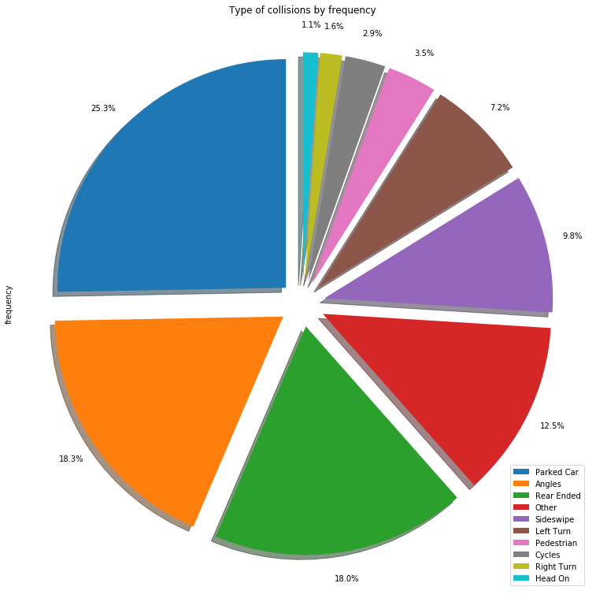
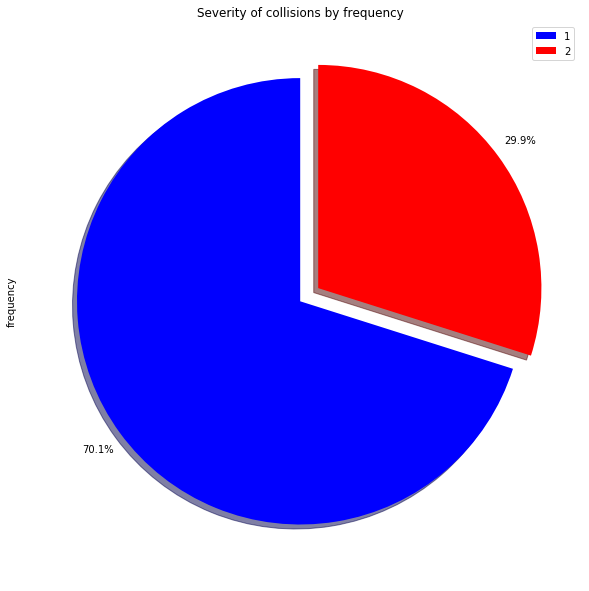
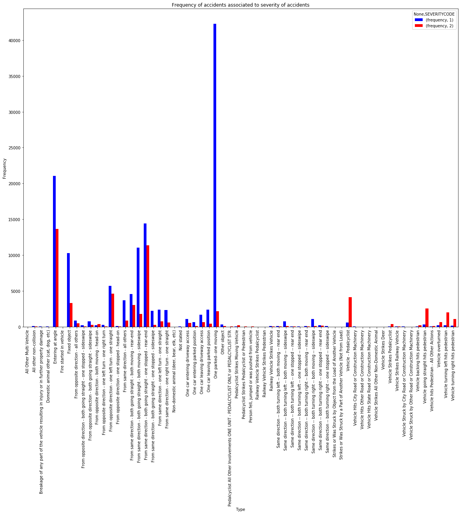
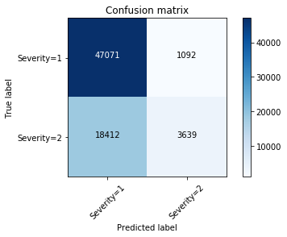

# Capstone Project - Seattle car accident data gathering and predictive model for Insurance Company

## Applied Data Science Capstone by IBM/Coursera 

## Table of Contents

<div class="alert alert-block alert-info" style="margin-top: 20px">
    <ol>
        <li><a href="## Introduction / Business Problem">Introduction</a></li>
        <li><a href="## Data">Data</a></li>
        <li><a href="## Exploratory Data Analysis (EDA)">Exploratory Data Analysis</a></li>
        <li><a href="## Model Construction">Model construction</a></li>
        <li><a href="## Conclusion">Conclusion</a></li>
    </ol>
</div>
<br>
<hr>

## Introduction / Business Problem

A growing **Health Insurance business** settled down in Seattle is **concerned about the price and conditions of insurance policies related to car accidents.** Stakeholders are having a hard time defining new policies and conditions related to coverage and *cost of insurances related to car accidents.* As no clear overview can be defined, it is clear that more information is needed to make a decision. **Increasing the cost** of the insurance would highly impact the desire of customers to acquire the service, so stakeholders want to determine what changes can be made to the coverage of the health policy related to car accidents.

**As such, stakeholders have decided that:**

1. They need to know the estimation of the number of accidents in the previous years.
2. From those accidents, how many accidents involve injuries for hospitalization. Fatalities are discarded as they're not covered inside the insurance.
3. Determine a way to predict if a car accident involves the hospitalization of the drivers affected.


With this information, stakeholders can clearly make decisions on how they should update their policies involving coverage in hospitalization costs related to car accidents. As such, a team of Data analysts was hired to find the necessary information and build a model that can predict the severity of a collision based on the car accident data of the previous years in Seattle.


**Our target audience will be the insurance company, and the customers that acquire the service.** The company will highly benefit from the information as if they know and segment their policies depending on the classification of the car accident, they could deduce clauses that would help them reduce costs due to affected customers. Also the customers acquiring the company service can be benefited as they'll be more aware of the type of accidents where they'll get coverage on, and how they could use the insurance service more effectively.

## Data

Based in the Business Problem presented above, we'll gather data focusing on:

- Parameters that influence the most accidents
- Type of collisions that were mostly registered
- Frequency of severity index associated to car accidents

As such, we will use an the car accident data set from previous years to determine which parameters or which type of collision can be associated to a higher severity index. 

### Parameter analysis

Before discussing the data, we're going to upload it to the current notebook in order to understand what kind of information we have in hand. 


```python
import numpy as np
import os
import matplotlib.pyplot as plt
import seaborn as sns
from sklearn import preprocessing
%matplotlib inline
```

Let's load the information


```python
import types
import pandas as pd
from botocore.client import Config
import ibm_boto3

def __iter__(self): return 0

# @hidden_cell
# The following code accesses a file in your IBM Cloud Object Storage. It includes your credentials.
# You might want to remove those credentials before you share the notebook.
client_09888307c6ef4063a9a107b821c8a1e0 = ibm_boto3.client(service_name='s3',
    ibm_api_key_id='DjvahiosCXiWAwfeXDDTesitIRBMGuKFUd673tBzV5c7',
    ibm_auth_endpoint="https://iam.cloud.ibm.com/oidc/token",
    config=Config(signature_version='oauth'),
    endpoint_url='https://s3-api.us-geo.objectstorage.service.networklayer.com')

body = client_09888307c6ef4063a9a107b821c8a1e0.get_object(Bucket='courseracapstoneproject-donotdelete-pr-otygyojtpjucg5',Key='Data-Collisions.csv')['Body']
# add missing __iter__ method, so pandas accepts body as file-like object
if not hasattr(body, "__iter__"): body.__iter__ = types.MethodType( __iter__, body )

df_data_1 = pd.read_csv(body)
df_data_1.head()

```

    /opt/conda/envs/Python36/lib/python3.6/site-packages/IPython/core/interactiveshell.py:3020: DtypeWarning: Columns (33) have mixed types. Specify dtype option on import or set low_memory=False.
      interactivity=interactivity, compiler=compiler, result=result)


<div>
<style scoped>
    .dataframe tbody tr th:only-of-type {
        vertical-align: middle;
    }

    .dataframe tbody tr th {
        vertical-align: top;
    }

    .dataframe thead th {
        text-align: right;
    }
</style>
<table border="1" class="dataframe">
  <thead>
    <tr style="text-align: right;">
      <th></th>
      <th>SEVERITYCODE</th>
      <th>X</th>
      <th>Y</th>
      <th>OBJECTID</th>
      <th>INCKEY</th>
      <th>COLDETKEY</th>
      <th>REPORTNO</th>
      <th>STATUS</th>
      <th>ADDRTYPE</th>
      <th>INTKEY</th>
      <th>...</th>
      <th>ROADCOND</th>
      <th>LIGHTCOND</th>
      <th>PEDROWNOTGRNT</th>
      <th>SDOTCOLNUM</th>
      <th>SPEEDING</th>
      <th>ST_COLCODE</th>
      <th>ST_COLDESC</th>
      <th>SEGLANEKEY</th>
      <th>CROSSWALKKEY</th>
      <th>HITPARKEDCAR</th>
    </tr>
  </thead>
  <tbody>
    <tr>
      <th>0</th>
      <td>2</td>
      <td>-122.323148</td>
      <td>47.703140</td>
      <td>1</td>
      <td>1307</td>
      <td>1307</td>
      <td>3502005</td>
      <td>Matched</td>
      <td>Intersection</td>
      <td>37475.0</td>
      <td>...</td>
      <td>Wet</td>
      <td>Daylight</td>
      <td>NaN</td>
      <td>NaN</td>
      <td>NaN</td>
      <td>10</td>
      <td>Entering at angle</td>
      <td>0</td>
      <td>0</td>
      <td>N</td>
    </tr>
    <tr>
      <th>1</th>
      <td>1</td>
      <td>-122.347294</td>
      <td>47.647172</td>
      <td>2</td>
      <td>52200</td>
      <td>52200</td>
      <td>2607959</td>
      <td>Matched</td>
      <td>Block</td>
      <td>NaN</td>
      <td>...</td>
      <td>Wet</td>
      <td>Dark - Street Lights On</td>
      <td>NaN</td>
      <td>6354039.0</td>
      <td>NaN</td>
      <td>11</td>
      <td>From same direction - both going straight - bo...</td>
      <td>0</td>
      <td>0</td>
      <td>N</td>
    </tr>
    <tr>
      <th>2</th>
      <td>1</td>
      <td>-122.334540</td>
      <td>47.607871</td>
      <td>3</td>
      <td>26700</td>
      <td>26700</td>
      <td>1482393</td>
      <td>Matched</td>
      <td>Block</td>
      <td>NaN</td>
      <td>...</td>
      <td>Dry</td>
      <td>Daylight</td>
      <td>NaN</td>
      <td>4323031.0</td>
      <td>NaN</td>
      <td>32</td>
      <td>One parked--one moving</td>
      <td>0</td>
      <td>0</td>
      <td>N</td>
    </tr>
    <tr>
      <th>3</th>
      <td>1</td>
      <td>-122.334803</td>
      <td>47.604803</td>
      <td>4</td>
      <td>1144</td>
      <td>1144</td>
      <td>3503937</td>
      <td>Matched</td>
      <td>Block</td>
      <td>NaN</td>
      <td>...</td>
      <td>Dry</td>
      <td>Daylight</td>
      <td>NaN</td>
      <td>NaN</td>
      <td>NaN</td>
      <td>23</td>
      <td>From same direction - all others</td>
      <td>0</td>
      <td>0</td>
      <td>N</td>
    </tr>
    <tr>
      <th>4</th>
      <td>2</td>
      <td>-122.306426</td>
      <td>47.545739</td>
      <td>5</td>
      <td>17700</td>
      <td>17700</td>
      <td>1807429</td>
      <td>Matched</td>
      <td>Intersection</td>
      <td>34387.0</td>
      <td>...</td>
      <td>Wet</td>
      <td>Daylight</td>
      <td>NaN</td>
      <td>4028032.0</td>
      <td>NaN</td>
      <td>10</td>
      <td>Entering at angle</td>
      <td>0</td>
      <td>0</td>
      <td>N</td>
    </tr>
  </tbody>
</table>
<p>5 rows × 38 columns</p>
</div>


Car accidents have many factors that produce them. In the case of Seattle, it would be good to determine which factor is the one that causes the more incidents. Is it the weather? Is the driver under the effects of alcohol or drugs? Was the driver distracted while driving? In this case, we we'll segment our dataframe to determine which conditions are the ones that cause the most accidents.

## Exploratory Data Analysis (EDA)

### Determining the number of accidents caused by bad weather


```python
df_data_1['WEATHER'].value_counts()
```


    Clear                       111135
    Raining                      33145
    Overcast                     27714
    Unknown                      15091
    Snowing                        907
    Other                          832
    Fog/Smog/Smoke                 569
    Sleet/Hail/Freezing Rain       113
    Blowing Sand/Dirt               56
    Severe Crosswind                25
    Partly Cloudy                    5
    Name: WEATHER, dtype: int64


As we can observe, most of the accidents were produced when there was clear weather, so we can discard weather as a big factor in car incidents. 

### Determining the number of accidents caused by distracted persons


```python
df_data_1['INATTENTIONIND'].value_counts()
```


    Y    29805
    Name: INATTENTIONIND, dtype: int64


We have even less incidents caused by distracted persons. We can deduce that the use of cellphone was not a big factor that caused the incidents.

### Determining the number of accidents caused by influence of alcohol or drugs


```python
df_data_1['UNDERINFL'].value_counts()
```


    N    100274
    0     80394
    Y      5126
    1      3995
    Name: UNDERINFL, dtype: int64


Again yet, there are not many cases pertaining people under influence to be considered a factor that causes accidents.

### Determining the number of accidents caused by road condition or lighting


```python
df_data_1['ROADCOND'].value_counts()
```


    Dry               124510
    Wet                47474
    Unknown            15078
    Ice                 1209
    Snow/Slush          1004
    Other                132
    Standing Water       115
    Sand/Mud/Dirt         75
    Oil                   64
    Name: ROADCOND, dtype: int64


```python
df_data_1['LIGHTCOND'].value_counts()
```


    Daylight                    116137
    Dark - Street Lights On      48507
    Unknown                      13473
    Dusk                          5902
    Dawn                          2502
    Dark - No Street Lights       1537
    Dark - Street Lights Off      1199
    Other                          235
    Dark - Unknown Lighting         11
    Name: LIGHTCOND, dtype: int64


Most of the accidents were caused in daylight, and under normal dry conditions of the road. I'm starting to think that most of the accidents may have been caused due to the avenues or streets disposition. Let's determine if the accidents occurred at intersection, highways or avenues. After determining the biggest factor, we can star working with the severity of each incident. 

### Places where incidents occurred


```python
df_data_1['JUNCTIONTYPE'].value_counts()
```


    Mid-Block (not related to intersection)              89800
    At Intersection (intersection related)               62810
    Mid-Block (but intersection related)                 22790
    Driveway Junction                                    10671
    At Intersection (but not related to intersection)     2098
    Ramp Junction                                          166
    Unknown                                                  9
    Name: JUNCTIONTYPE, dtype: int64


Ok, now we know that most of the incidents are not necessarily at junctions, they were produced Mid-Block. Now I question. Where the drivers speeding up?


```python
df_data_1['SPEEDING'].value_counts()
```


    Y    9333
    Name: SPEEDING, dtype: int64


Most of the drivers were not speeding, as the total number of incidents is higher in comparison. As we can see, we have determined that the normal studied factors that cause accidents cannot be used to determine incidence as most incidents have been casual incidents under normal weather, dry conditions, by persons that were concentrated driving. So moving on, it would be good to determine the type of collision and how severe the collisions were. 

### Type of incident


```python
df_type=df_data_1['ST_COLDESC'].value_counts() 
df_type.head(6)
```


    One parked--one moving                                                 44421
    Entering at angle                                                      34674
    From same direction - both going straight - one stopped - rear-end     25771
    Fixed object                                                           13554
    From same direction - both going straight - both moving - sideswipe    12777
    From opposite direction - one left turn - one straight                 10324
    Name: ST_COLDESC, dtype: int64


```python
df_counts1=df_data_1['COLLISIONTYPE'].value_counts().reset_index(name='frequency')
df_counts1
```


<div>
<style scoped>
    .dataframe tbody tr th:only-of-type {
        vertical-align: middle;
    }

    .dataframe tbody tr th {
        vertical-align: top;
    }

    .dataframe thead th {
        text-align: right;
    }
</style>
<table border="1" class="dataframe">
  <thead>
    <tr style="text-align: right;">
      <th></th>
      <th>index</th>
      <th>frequency</th>
    </tr>
  </thead>
  <tbody>
    <tr>
      <th>0</th>
      <td>Parked Car</td>
      <td>47987</td>
    </tr>
    <tr>
      <th>1</th>
      <td>Angles</td>
      <td>34674</td>
    </tr>
    <tr>
      <th>2</th>
      <td>Rear Ended</td>
      <td>34090</td>
    </tr>
    <tr>
      <th>3</th>
      <td>Other</td>
      <td>23703</td>
    </tr>
    <tr>
      <th>4</th>
      <td>Sideswipe</td>
      <td>18609</td>
    </tr>
    <tr>
      <th>5</th>
      <td>Left Turn</td>
      <td>13703</td>
    </tr>
    <tr>
      <th>6</th>
      <td>Pedestrian</td>
      <td>6608</td>
    </tr>
    <tr>
      <th>7</th>
      <td>Cycles</td>
      <td>5415</td>
    </tr>
    <tr>
      <th>8</th>
      <td>Right Turn</td>
      <td>2956</td>
    </tr>
    <tr>
      <th>9</th>
      <td>Head On</td>
      <td>2024</td>
    </tr>
  </tbody>
</table>
</div>


```python
explode_list = [0.1, 0.1, 0.1, 0.1, 0.1, 0.1, 0.1, 0.1, 0.1, 0.1]
df_counts1['frequency'].plot(kind='pie',
                            figsize=(13, 18),
                            autopct='%1.1f%%', 
                            startangle=90,    
                            shadow=True,       
                            labels=None,
                            pctdistance=1.12,
                            explode = explode_list)

plt.title('Type of collisions by frequency')
plt.legend(labels=df_counts1['index'], loc='lower right') 
plt.show()
```





As stated, most of the accidents have been casual incidents. Taking the 6 types that have more influence over the dataframe, it would be good to determine if they have a relationship with the severity index. Afterwards, we can use the rest of the dataframe to determine if the other types of incidents have a high severity index. We start by determining the counts in the severity index.


```python
df_counts=df_data_1['SEVERITYCODE'].value_counts().reset_index(name='frequency')
df_counts
```


<div>
<style scoped>
    .dataframe tbody tr th:only-of-type {
        vertical-align: middle;
    }

    .dataframe tbody tr th {
        vertical-align: top;
    }

    .dataframe thead th {
        text-align: right;
    }
</style>
<table border="1" class="dataframe">
  <thead>
    <tr style="text-align: right;">
      <th></th>
      <th>index</th>
      <th>frequency</th>
    </tr>
  </thead>
  <tbody>
    <tr>
      <th>0</th>
      <td>1</td>
      <td>136485</td>
    </tr>
    <tr>
      <th>1</th>
      <td>2</td>
      <td>58188</td>
    </tr>
  </tbody>
</table>
</div>


```python
explode_list = [0, 0.1]
df_counts['frequency'].plot(kind='pie',
                            figsize=(10, 15),
                            autopct='%1.1f%%', 
                            startangle=90,    
                            shadow=True,       
                            labels=None,
                            colors=['blue','red'],
                            pctdistance=1.12,
                            explode = explode_list)

plt.title('Severity of collisions by frequency')
plt.legend(labels=df_counts['index'], loc='upper right') 
plt.show()
```





Is good to see that from all the information gathered, the incidents don't involve serious injuries or fatalities. Most of the incidents are related to property damage. So, let's analyze if there's a relationship between the type of collision and the severity of the incident. 


```python
df_st=df_data_1.groupby('ST_COLDESC')['SEVERITYCODE'].value_counts().reset_index(name="frequency")
df_st.set_index(['ST_COLDESC'], inplace=True)
df_st.set_index(['SEVERITYCODE'], append=True, inplace=True)
df_st=df_st.sort_values(['frequency'], ascending=False)
df_st.head(20)
```


<div>
<style scoped>
    .dataframe tbody tr th:only-of-type {
        vertical-align: middle;
    }

    .dataframe tbody tr th {
        vertical-align: top;
    }

    .dataframe thead th {
        text-align: right;
    }
</style>
<table border="1" class="dataframe">
  <thead>
    <tr style="text-align: right;">
      <th></th>
      <th></th>
      <th>frequency</th>
    </tr>
    <tr>
      <th>ST_COLDESC</th>
      <th>SEVERITYCODE</th>
      <th></th>
    </tr>
  </thead>
  <tbody>
    <tr>
      <th>One parked--one moving</th>
      <th>1</th>
      <td>42276</td>
    </tr>
    <tr>
      <th>Entering at angle</th>
      <th>1</th>
      <td>21050</td>
    </tr>
    <tr>
      <th>From same direction - both going straight - one stopped - rear-end</th>
      <th>1</th>
      <td>14403</td>
    </tr>
    <tr>
      <th>Entering at angle</th>
      <th>2</th>
      <td>13624</td>
    </tr>
    <tr>
      <th>From same direction - both going straight - one stopped - rear-end</th>
      <th>2</th>
      <td>11368</td>
    </tr>
    <tr>
      <th>From same direction - both going straight - both moving - sideswipe</th>
      <th>1</th>
      <td>11016</td>
    </tr>
    <tr>
      <th>Fixed object</th>
      <th>1</th>
      <td>10263</td>
    </tr>
    <tr>
      <th rowspan="2" valign="top">From opposite direction - one left turn - one straight</th>
      <th>1</th>
      <td>5693</td>
    </tr>
    <tr>
      <th>2</th>
      <td>4631</td>
    </tr>
    <tr>
      <th>From same direction - both going straight - both moving - rear-end</th>
      <th>1</th>
      <td>4575</td>
    </tr>
    <tr>
      <th>Vehicle - Pedalcyclist</th>
      <th>2</th>
      <td>4122</td>
    </tr>
    <tr>
      <th>From same direction - all others</th>
      <th>1</th>
      <td>3697</td>
    </tr>
    <tr>
      <th>Fixed object</th>
      <th>2</th>
      <td>3291</td>
    </tr>
    <tr>
      <th>From same direction - both going straight - both moving - rear-end</th>
      <th>2</th>
      <td>3054</td>
    </tr>
    <tr>
      <th>Vehicle going straight hits pedestrian</th>
      <th>2</th>
      <td>2567</td>
    </tr>
    <tr>
      <th>One car leaving parked position</th>
      <th>1</th>
      <td>2404</td>
    </tr>
    <tr>
      <th>From same direction - one left turn - one straight</th>
      <th>1</th>
      <td>2362</td>
    </tr>
    <tr>
      <th>From same direction - one right turn - one straight</th>
      <th>1</th>
      <td>2347</td>
    </tr>
    <tr>
      <th>From same direction - both going straight - one stopped - sideswipe</th>
      <th>1</th>
      <td>2188</td>
    </tr>
    <tr>
      <th>One parked--one moving</th>
      <th>2</th>
      <td>2145</td>
    </tr>
  </tbody>
</table>
</div>


```python
df_st=df_st.unstack(level=[1])
```


```python
df_st.plot(kind='bar', figsize=(20,15), color=['blue','red'], width=0.8)

plt.title('Frequency of accidents associated to severity of accidents')
plt.xlabel('Type')
plt.ylabel('Frequency')
```


    Text(0, 0.5, 'Frequency')





Now we have the most common type of collisions and the severity associated to those collisions. As we can see, the top type of collision is one parked and one moving. The severity associated to this type of collision relates to propietary damage. On the other hand, we see that incidents produced at angles have the most cases related to injuries in term of severity, but we also see from the graph above that accidents involving pedestrians and cyclists will most probably end in injury. As such, we could use the type of collision in order to predict whether an incident is of class "1" or class "2". This will be our key independent variable. As such, we will add other factors to our clean data frame that will increase the accuracy of our prediction in terms of predicting the severity of the collision.

### Dataframe cleaning process

We start by cleaning up our original dataframe, we start by determining the type of each column


```python
df_data_1.dtypes
```


    SEVERITYCODE        int64
    X                 float64
    Y                 float64
    OBJECTID            int64
    INCKEY              int64
    COLDETKEY           int64
    REPORTNO           object
    STATUS             object
    ADDRTYPE           object
    INTKEY            float64
    LOCATION           object
    EXCEPTRSNCODE      object
    EXCEPTRSNDESC      object
    SEVERITYCODE.1      int64
    SEVERITYDESC       object
    COLLISIONTYPE      object
    PERSONCOUNT         int64
    PEDCOUNT            int64
    PEDCYLCOUNT         int64
    VEHCOUNT            int64
    INCDATE            object
    INCDTTM            object
    JUNCTIONTYPE       object
    SDOT_COLCODE        int64
    SDOT_COLDESC       object
    INATTENTIONIND     object
    UNDERINFL          object
    WEATHER            object
    ROADCOND           object
    LIGHTCOND          object
    PEDROWNOTGRNT      object
    SDOTCOLNUM        float64
    SPEEDING           object
    ST_COLCODE         object
    ST_COLDESC         object
    SEGLANEKEY          int64
    CROSSWALKKEY        int64
    HITPARKEDCAR       object
    dtype: object


```python
df_data_1.shape
```


    (194673, 38)


We have 38 different type of variables, so we can start by dropping columns we consider irrelevant to our current purpose like ID, location, number of injuries, and fatalities, as we already determined that the current dataset has no fatalities in the data. 


```python
df = df_data_1.drop(['X','Y','OBJECTID','INCKEY','COLDETKEY','REPORTNO','STATUS','INTKEY'], axis=1)
df.head(5)
```


<div>
<style scoped>
    .dataframe tbody tr th:only-of-type {
        vertical-align: middle;
    }

    .dataframe tbody tr th {
        vertical-align: top;
    }

    .dataframe thead th {
        text-align: right;
    }
</style>
<table border="1" class="dataframe">
  <thead>
    <tr style="text-align: right;">
      <th></th>
      <th>SEVERITYCODE</th>
      <th>ADDRTYPE</th>
      <th>LOCATION</th>
      <th>EXCEPTRSNCODE</th>
      <th>EXCEPTRSNDESC</th>
      <th>SEVERITYCODE.1</th>
      <th>SEVERITYDESC</th>
      <th>COLLISIONTYPE</th>
      <th>PERSONCOUNT</th>
      <th>PEDCOUNT</th>
      <th>...</th>
      <th>ROADCOND</th>
      <th>LIGHTCOND</th>
      <th>PEDROWNOTGRNT</th>
      <th>SDOTCOLNUM</th>
      <th>SPEEDING</th>
      <th>ST_COLCODE</th>
      <th>ST_COLDESC</th>
      <th>SEGLANEKEY</th>
      <th>CROSSWALKKEY</th>
      <th>HITPARKEDCAR</th>
    </tr>
  </thead>
  <tbody>
    <tr>
      <th>0</th>
      <td>2</td>
      <td>Intersection</td>
      <td>5TH AVE NE AND NE 103RD ST</td>
      <td></td>
      <td>NaN</td>
      <td>2</td>
      <td>Injury Collision</td>
      <td>Angles</td>
      <td>2</td>
      <td>0</td>
      <td>...</td>
      <td>Wet</td>
      <td>Daylight</td>
      <td>NaN</td>
      <td>NaN</td>
      <td>NaN</td>
      <td>10</td>
      <td>Entering at angle</td>
      <td>0</td>
      <td>0</td>
      <td>N</td>
    </tr>
    <tr>
      <th>1</th>
      <td>1</td>
      <td>Block</td>
      <td>AURORA BR BETWEEN RAYE ST AND BRIDGE WAY N</td>
      <td>NaN</td>
      <td>NaN</td>
      <td>1</td>
      <td>Property Damage Only Collision</td>
      <td>Sideswipe</td>
      <td>2</td>
      <td>0</td>
      <td>...</td>
      <td>Wet</td>
      <td>Dark - Street Lights On</td>
      <td>NaN</td>
      <td>6354039.0</td>
      <td>NaN</td>
      <td>11</td>
      <td>From same direction - both going straight - bo...</td>
      <td>0</td>
      <td>0</td>
      <td>N</td>
    </tr>
    <tr>
      <th>2</th>
      <td>1</td>
      <td>Block</td>
      <td>4TH AVE BETWEEN SENECA ST AND UNIVERSITY ST</td>
      <td>NaN</td>
      <td>NaN</td>
      <td>1</td>
      <td>Property Damage Only Collision</td>
      <td>Parked Car</td>
      <td>4</td>
      <td>0</td>
      <td>...</td>
      <td>Dry</td>
      <td>Daylight</td>
      <td>NaN</td>
      <td>4323031.0</td>
      <td>NaN</td>
      <td>32</td>
      <td>One parked--one moving</td>
      <td>0</td>
      <td>0</td>
      <td>N</td>
    </tr>
    <tr>
      <th>3</th>
      <td>1</td>
      <td>Block</td>
      <td>2ND AVE BETWEEN MARION ST AND MADISON ST</td>
      <td></td>
      <td>NaN</td>
      <td>1</td>
      <td>Property Damage Only Collision</td>
      <td>Other</td>
      <td>3</td>
      <td>0</td>
      <td>...</td>
      <td>Dry</td>
      <td>Daylight</td>
      <td>NaN</td>
      <td>NaN</td>
      <td>NaN</td>
      <td>23</td>
      <td>From same direction - all others</td>
      <td>0</td>
      <td>0</td>
      <td>N</td>
    </tr>
    <tr>
      <th>4</th>
      <td>2</td>
      <td>Intersection</td>
      <td>SWIFT AVE S AND SWIFT AV OFF RP</td>
      <td>NaN</td>
      <td>NaN</td>
      <td>2</td>
      <td>Injury Collision</td>
      <td>Angles</td>
      <td>2</td>
      <td>0</td>
      <td>...</td>
      <td>Wet</td>
      <td>Daylight</td>
      <td>NaN</td>
      <td>4028032.0</td>
      <td>NaN</td>
      <td>10</td>
      <td>Entering at angle</td>
      <td>0</td>
      <td>0</td>
      <td>N</td>
    </tr>
  </tbody>
</table>
<p>5 rows × 30 columns</p>
</div>


```python
df = df.drop(['LOCATION','EXCEPTRSNCODE','EXCEPTRSNDESC','SEVERITYDESC','SDOT_COLCODE','SDOT_COLDESC','SDOTCOLNUM'], axis=1)
df.head(5)
```


<div>
<style scoped>
    .dataframe tbody tr th:only-of-type {
        vertical-align: middle;
    }

    .dataframe tbody tr th {
        vertical-align: top;
    }

    .dataframe thead th {
        text-align: right;
    }
</style>
<table border="1" class="dataframe">
  <thead>
    <tr style="text-align: right;">
      <th></th>
      <th>SEVERITYCODE</th>
      <th>ADDRTYPE</th>
      <th>SEVERITYCODE.1</th>
      <th>COLLISIONTYPE</th>
      <th>PERSONCOUNT</th>
      <th>PEDCOUNT</th>
      <th>PEDCYLCOUNT</th>
      <th>VEHCOUNT</th>
      <th>INCDATE</th>
      <th>INCDTTM</th>
      <th>...</th>
      <th>WEATHER</th>
      <th>ROADCOND</th>
      <th>LIGHTCOND</th>
      <th>PEDROWNOTGRNT</th>
      <th>SPEEDING</th>
      <th>ST_COLCODE</th>
      <th>ST_COLDESC</th>
      <th>SEGLANEKEY</th>
      <th>CROSSWALKKEY</th>
      <th>HITPARKEDCAR</th>
    </tr>
  </thead>
  <tbody>
    <tr>
      <th>0</th>
      <td>2</td>
      <td>Intersection</td>
      <td>2</td>
      <td>Angles</td>
      <td>2</td>
      <td>0</td>
      <td>0</td>
      <td>2</td>
      <td>2013/03/27 00:00:00+00</td>
      <td>3/27/2013 2:54:00 PM</td>
      <td>...</td>
      <td>Overcast</td>
      <td>Wet</td>
      <td>Daylight</td>
      <td>NaN</td>
      <td>NaN</td>
      <td>10</td>
      <td>Entering at angle</td>
      <td>0</td>
      <td>0</td>
      <td>N</td>
    </tr>
    <tr>
      <th>1</th>
      <td>1</td>
      <td>Block</td>
      <td>1</td>
      <td>Sideswipe</td>
      <td>2</td>
      <td>0</td>
      <td>0</td>
      <td>2</td>
      <td>2006/12/20 00:00:00+00</td>
      <td>12/20/2006 6:55:00 PM</td>
      <td>...</td>
      <td>Raining</td>
      <td>Wet</td>
      <td>Dark - Street Lights On</td>
      <td>NaN</td>
      <td>NaN</td>
      <td>11</td>
      <td>From same direction - both going straight - bo...</td>
      <td>0</td>
      <td>0</td>
      <td>N</td>
    </tr>
    <tr>
      <th>2</th>
      <td>1</td>
      <td>Block</td>
      <td>1</td>
      <td>Parked Car</td>
      <td>4</td>
      <td>0</td>
      <td>0</td>
      <td>3</td>
      <td>2004/11/18 00:00:00+00</td>
      <td>11/18/2004 10:20:00 AM</td>
      <td>...</td>
      <td>Overcast</td>
      <td>Dry</td>
      <td>Daylight</td>
      <td>NaN</td>
      <td>NaN</td>
      <td>32</td>
      <td>One parked--one moving</td>
      <td>0</td>
      <td>0</td>
      <td>N</td>
    </tr>
    <tr>
      <th>3</th>
      <td>1</td>
      <td>Block</td>
      <td>1</td>
      <td>Other</td>
      <td>3</td>
      <td>0</td>
      <td>0</td>
      <td>3</td>
      <td>2013/03/29 00:00:00+00</td>
      <td>3/29/2013 9:26:00 AM</td>
      <td>...</td>
      <td>Clear</td>
      <td>Dry</td>
      <td>Daylight</td>
      <td>NaN</td>
      <td>NaN</td>
      <td>23</td>
      <td>From same direction - all others</td>
      <td>0</td>
      <td>0</td>
      <td>N</td>
    </tr>
    <tr>
      <th>4</th>
      <td>2</td>
      <td>Intersection</td>
      <td>2</td>
      <td>Angles</td>
      <td>2</td>
      <td>0</td>
      <td>0</td>
      <td>2</td>
      <td>2004/01/28 00:00:00+00</td>
      <td>1/28/2004 8:04:00 AM</td>
      <td>...</td>
      <td>Raining</td>
      <td>Wet</td>
      <td>Daylight</td>
      <td>NaN</td>
      <td>NaN</td>
      <td>10</td>
      <td>Entering at angle</td>
      <td>0</td>
      <td>0</td>
      <td>N</td>
    </tr>
  </tbody>
</table>
<p>5 rows × 23 columns</p>
</div>


```python
df = df.drop(['SEGLANEKEY','CROSSWALKKEY','WEATHER','LIGHTCOND','ROADCOND','ADDRTYPE','PERSONCOUNT','PEDCOUNT'], axis=1)
df.head()
```


<div>
<style scoped>
    .dataframe tbody tr th:only-of-type {
        vertical-align: middle;
    }

    .dataframe tbody tr th {
        vertical-align: top;
    }

    .dataframe thead th {
        text-align: right;
    }
</style>
<table border="1" class="dataframe">
  <thead>
    <tr style="text-align: right;">
      <th></th>
      <th>SEVERITYCODE</th>
      <th>SEVERITYCODE.1</th>
      <th>COLLISIONTYPE</th>
      <th>PEDCYLCOUNT</th>
      <th>VEHCOUNT</th>
      <th>INCDATE</th>
      <th>INCDTTM</th>
      <th>JUNCTIONTYPE</th>
      <th>INATTENTIONIND</th>
      <th>UNDERINFL</th>
      <th>PEDROWNOTGRNT</th>
      <th>SPEEDING</th>
      <th>ST_COLCODE</th>
      <th>ST_COLDESC</th>
      <th>HITPARKEDCAR</th>
    </tr>
  </thead>
  <tbody>
    <tr>
      <th>0</th>
      <td>2</td>
      <td>2</td>
      <td>Angles</td>
      <td>0</td>
      <td>2</td>
      <td>2013/03/27 00:00:00+00</td>
      <td>3/27/2013 2:54:00 PM</td>
      <td>At Intersection (intersection related)</td>
      <td>NaN</td>
      <td>N</td>
      <td>NaN</td>
      <td>NaN</td>
      <td>10</td>
      <td>Entering at angle</td>
      <td>N</td>
    </tr>
    <tr>
      <th>1</th>
      <td>1</td>
      <td>1</td>
      <td>Sideswipe</td>
      <td>0</td>
      <td>2</td>
      <td>2006/12/20 00:00:00+00</td>
      <td>12/20/2006 6:55:00 PM</td>
      <td>Mid-Block (not related to intersection)</td>
      <td>NaN</td>
      <td>0</td>
      <td>NaN</td>
      <td>NaN</td>
      <td>11</td>
      <td>From same direction - both going straight - bo...</td>
      <td>N</td>
    </tr>
    <tr>
      <th>2</th>
      <td>1</td>
      <td>1</td>
      <td>Parked Car</td>
      <td>0</td>
      <td>3</td>
      <td>2004/11/18 00:00:00+00</td>
      <td>11/18/2004 10:20:00 AM</td>
      <td>Mid-Block (not related to intersection)</td>
      <td>NaN</td>
      <td>0</td>
      <td>NaN</td>
      <td>NaN</td>
      <td>32</td>
      <td>One parked--one moving</td>
      <td>N</td>
    </tr>
    <tr>
      <th>3</th>
      <td>1</td>
      <td>1</td>
      <td>Other</td>
      <td>0</td>
      <td>3</td>
      <td>2013/03/29 00:00:00+00</td>
      <td>3/29/2013 9:26:00 AM</td>
      <td>Mid-Block (not related to intersection)</td>
      <td>NaN</td>
      <td>N</td>
      <td>NaN</td>
      <td>NaN</td>
      <td>23</td>
      <td>From same direction - all others</td>
      <td>N</td>
    </tr>
    <tr>
      <th>4</th>
      <td>2</td>
      <td>2</td>
      <td>Angles</td>
      <td>0</td>
      <td>2</td>
      <td>2004/01/28 00:00:00+00</td>
      <td>1/28/2004 8:04:00 AM</td>
      <td>At Intersection (intersection related)</td>
      <td>NaN</td>
      <td>0</td>
      <td>NaN</td>
      <td>NaN</td>
      <td>10</td>
      <td>Entering at angle</td>
      <td>N</td>
    </tr>
  </tbody>
</table>
</div>


```python
df = df.drop(['VEHCOUNT','INCDATE','SEVERITYCODE.1'], axis=1)
df.head()
```


<div>
<style scoped>
    .dataframe tbody tr th:only-of-type {
        vertical-align: middle;
    }

    .dataframe tbody tr th {
        vertical-align: top;
    }

    .dataframe thead th {
        text-align: right;
    }
</style>
<table border="1" class="dataframe">
  <thead>
    <tr style="text-align: right;">
      <th></th>
      <th>SEVERITYCODE</th>
      <th>COLLISIONTYPE</th>
      <th>PEDCYLCOUNT</th>
      <th>INCDTTM</th>
      <th>JUNCTIONTYPE</th>
      <th>INATTENTIONIND</th>
      <th>UNDERINFL</th>
      <th>PEDROWNOTGRNT</th>
      <th>SPEEDING</th>
      <th>ST_COLCODE</th>
      <th>ST_COLDESC</th>
      <th>HITPARKEDCAR</th>
    </tr>
  </thead>
  <tbody>
    <tr>
      <th>0</th>
      <td>2</td>
      <td>Angles</td>
      <td>0</td>
      <td>3/27/2013 2:54:00 PM</td>
      <td>At Intersection (intersection related)</td>
      <td>NaN</td>
      <td>N</td>
      <td>NaN</td>
      <td>NaN</td>
      <td>10</td>
      <td>Entering at angle</td>
      <td>N</td>
    </tr>
    <tr>
      <th>1</th>
      <td>1</td>
      <td>Sideswipe</td>
      <td>0</td>
      <td>12/20/2006 6:55:00 PM</td>
      <td>Mid-Block (not related to intersection)</td>
      <td>NaN</td>
      <td>0</td>
      <td>NaN</td>
      <td>NaN</td>
      <td>11</td>
      <td>From same direction - both going straight - bo...</td>
      <td>N</td>
    </tr>
    <tr>
      <th>2</th>
      <td>1</td>
      <td>Parked Car</td>
      <td>0</td>
      <td>11/18/2004 10:20:00 AM</td>
      <td>Mid-Block (not related to intersection)</td>
      <td>NaN</td>
      <td>0</td>
      <td>NaN</td>
      <td>NaN</td>
      <td>32</td>
      <td>One parked--one moving</td>
      <td>N</td>
    </tr>
    <tr>
      <th>3</th>
      <td>1</td>
      <td>Other</td>
      <td>0</td>
      <td>3/29/2013 9:26:00 AM</td>
      <td>Mid-Block (not related to intersection)</td>
      <td>NaN</td>
      <td>N</td>
      <td>NaN</td>
      <td>NaN</td>
      <td>23</td>
      <td>From same direction - all others</td>
      <td>N</td>
    </tr>
    <tr>
      <th>4</th>
      <td>2</td>
      <td>Angles</td>
      <td>0</td>
      <td>1/28/2004 8:04:00 AM</td>
      <td>At Intersection (intersection related)</td>
      <td>NaN</td>
      <td>0</td>
      <td>NaN</td>
      <td>NaN</td>
      <td>10</td>
      <td>Entering at angle</td>
      <td>N</td>
    </tr>
  </tbody>
</table>
</div>


Now we have a less robust dataframe to analyze with some nice factors that could help us predict the severity of the incidents, but we still need to clean the dataframe a bit more. We proceed to clean up the dataframe determining if there are null rows or copied rows.

### Further cleaning the data set

We start by determining if there are duplicate rows in our dataset as that would affect the accuracy of our model. 


```python
duplicate_rows_df = df[df.duplicated()]
print("number of duplicate rows: ", duplicate_rows_df.shape)
```

    number of duplicate rows:  (9687, 12)


```python
df.count()
```


    SEVERITYCODE      194673
    COLLISIONTYPE     189769
    PEDCYLCOUNT       194673
    INCDTTM           194673
    JUNCTIONTYPE      188344
    INATTENTIONIND     29805
    UNDERINFL         189789
    PEDROWNOTGRNT       4667
    SPEEDING            9333
    ST_COLCODE        194655
    ST_COLDESC        189769
    HITPARKEDCAR      194673
    dtype: int64


```python
df = df.drop_duplicates()
df.head(5)
```


<div>
<style scoped>
    .dataframe tbody tr th:only-of-type {
        vertical-align: middle;
    }

    .dataframe tbody tr th {
        vertical-align: top;
    }

    .dataframe thead th {
        text-align: right;
    }
</style>
<table border="1" class="dataframe">
  <thead>
    <tr style="text-align: right;">
      <th></th>
      <th>SEVERITYCODE</th>
      <th>COLLISIONTYPE</th>
      <th>PEDCYLCOUNT</th>
      <th>INCDTTM</th>
      <th>JUNCTIONTYPE</th>
      <th>INATTENTIONIND</th>
      <th>UNDERINFL</th>
      <th>PEDROWNOTGRNT</th>
      <th>SPEEDING</th>
      <th>ST_COLCODE</th>
      <th>ST_COLDESC</th>
      <th>HITPARKEDCAR</th>
    </tr>
  </thead>
  <tbody>
    <tr>
      <th>0</th>
      <td>2</td>
      <td>Angles</td>
      <td>0</td>
      <td>3/27/2013 2:54:00 PM</td>
      <td>At Intersection (intersection related)</td>
      <td>NaN</td>
      <td>N</td>
      <td>NaN</td>
      <td>NaN</td>
      <td>10</td>
      <td>Entering at angle</td>
      <td>N</td>
    </tr>
    <tr>
      <th>1</th>
      <td>1</td>
      <td>Sideswipe</td>
      <td>0</td>
      <td>12/20/2006 6:55:00 PM</td>
      <td>Mid-Block (not related to intersection)</td>
      <td>NaN</td>
      <td>0</td>
      <td>NaN</td>
      <td>NaN</td>
      <td>11</td>
      <td>From same direction - both going straight - bo...</td>
      <td>N</td>
    </tr>
    <tr>
      <th>2</th>
      <td>1</td>
      <td>Parked Car</td>
      <td>0</td>
      <td>11/18/2004 10:20:00 AM</td>
      <td>Mid-Block (not related to intersection)</td>
      <td>NaN</td>
      <td>0</td>
      <td>NaN</td>
      <td>NaN</td>
      <td>32</td>
      <td>One parked--one moving</td>
      <td>N</td>
    </tr>
    <tr>
      <th>3</th>
      <td>1</td>
      <td>Other</td>
      <td>0</td>
      <td>3/29/2013 9:26:00 AM</td>
      <td>Mid-Block (not related to intersection)</td>
      <td>NaN</td>
      <td>N</td>
      <td>NaN</td>
      <td>NaN</td>
      <td>23</td>
      <td>From same direction - all others</td>
      <td>N</td>
    </tr>
    <tr>
      <th>4</th>
      <td>2</td>
      <td>Angles</td>
      <td>0</td>
      <td>1/28/2004 8:04:00 AM</td>
      <td>At Intersection (intersection related)</td>
      <td>NaN</td>
      <td>0</td>
      <td>NaN</td>
      <td>NaN</td>
      <td>10</td>
      <td>Entering at angle</td>
      <td>N</td>
    </tr>
  </tbody>
</table>
</div>


```python
df.count()
```


    SEVERITYCODE      184986
    COLLISIONTYPE     181557
    PEDCYLCOUNT       184986
    INCDTTM           184986
    JUNCTIONTYPE      178821
    INATTENTIONIND     29542
    UNDERINFL         181577
    PEDROWNOTGRNT       4628
    SPEEDING            9245
    ST_COLCODE        184968
    ST_COLDESC        181557
    HITPARKEDCAR      184986
    dtype: int64


As we have seen in the counts, we have almost eliminated 10000 duplicate rows. We proceed in determining if there are null values in our dataframe. 


```python
print(df.isnull().sum())
```

    SEVERITYCODE           0
    COLLISIONTYPE       3429
    PEDCYLCOUNT            0
    INCDTTM                0
    JUNCTIONTYPE        6165
    INATTENTIONIND    155444
    UNDERINFL           3409
    PEDROWNOTGRNT     180358
    SPEEDING          175741
    ST_COLCODE            18
    ST_COLDESC          3429
    HITPARKEDCAR           0
    dtype: int64


If we drop null values in this dataframe, we would be eliminating a lot of rows, so we just proceed with our current data frame.

### Final Working Data Set

Now we have a clean data set to work with. 


```python
df
```


<div>
<style scoped>
    .dataframe tbody tr th:only-of-type {
        vertical-align: middle;
    }

    .dataframe tbody tr th {
        vertical-align: top;
    }

    .dataframe thead th {
        text-align: right;
    }
</style>
<table border="1" class="dataframe">
  <thead>
    <tr style="text-align: right;">
      <th></th>
      <th>SEVERITYCODE</th>
      <th>COLLISIONTYPE</th>
      <th>PEDCYLCOUNT</th>
      <th>INCDTTM</th>
      <th>JUNCTIONTYPE</th>
      <th>INATTENTIONIND</th>
      <th>UNDERINFL</th>
      <th>PEDROWNOTGRNT</th>
      <th>SPEEDING</th>
      <th>ST_COLCODE</th>
      <th>ST_COLDESC</th>
      <th>HITPARKEDCAR</th>
    </tr>
  </thead>
  <tbody>
    <tr>
      <th>0</th>
      <td>2</td>
      <td>Angles</td>
      <td>0</td>
      <td>3/27/2013 2:54:00 PM</td>
      <td>At Intersection (intersection related)</td>
      <td>NaN</td>
      <td>N</td>
      <td>NaN</td>
      <td>NaN</td>
      <td>10</td>
      <td>Entering at angle</td>
      <td>N</td>
    </tr>
    <tr>
      <th>1</th>
      <td>1</td>
      <td>Sideswipe</td>
      <td>0</td>
      <td>12/20/2006 6:55:00 PM</td>
      <td>Mid-Block (not related to intersection)</td>
      <td>NaN</td>
      <td>0</td>
      <td>NaN</td>
      <td>NaN</td>
      <td>11</td>
      <td>From same direction - both going straight - bo...</td>
      <td>N</td>
    </tr>
    <tr>
      <th>2</th>
      <td>1</td>
      <td>Parked Car</td>
      <td>0</td>
      <td>11/18/2004 10:20:00 AM</td>
      <td>Mid-Block (not related to intersection)</td>
      <td>NaN</td>
      <td>0</td>
      <td>NaN</td>
      <td>NaN</td>
      <td>32</td>
      <td>One parked--one moving</td>
      <td>N</td>
    </tr>
    <tr>
      <th>3</th>
      <td>1</td>
      <td>Other</td>
      <td>0</td>
      <td>3/29/2013 9:26:00 AM</td>
      <td>Mid-Block (not related to intersection)</td>
      <td>NaN</td>
      <td>N</td>
      <td>NaN</td>
      <td>NaN</td>
      <td>23</td>
      <td>From same direction - all others</td>
      <td>N</td>
    </tr>
    <tr>
      <th>4</th>
      <td>2</td>
      <td>Angles</td>
      <td>0</td>
      <td>1/28/2004 8:04:00 AM</td>
      <td>At Intersection (intersection related)</td>
      <td>NaN</td>
      <td>0</td>
      <td>NaN</td>
      <td>NaN</td>
      <td>10</td>
      <td>Entering at angle</td>
      <td>N</td>
    </tr>
    <tr>
      <th>5</th>
      <td>1</td>
      <td>Angles</td>
      <td>0</td>
      <td>4/20/2019 5:42:00 PM</td>
      <td>At Intersection (intersection related)</td>
      <td>NaN</td>
      <td>N</td>
      <td>NaN</td>
      <td>NaN</td>
      <td>10</td>
      <td>Entering at angle</td>
      <td>N</td>
    </tr>
    <tr>
      <th>6</th>
      <td>1</td>
      <td>Angles</td>
      <td>0</td>
      <td>12/9/2008</td>
      <td>At Intersection (intersection related)</td>
      <td>NaN</td>
      <td>0</td>
      <td>NaN</td>
      <td>NaN</td>
      <td>10</td>
      <td>Entering at angle</td>
      <td>N</td>
    </tr>
    <tr>
      <th>7</th>
      <td>2</td>
      <td>Cycles</td>
      <td>1</td>
      <td>4/15/2020 5:47:00 PM</td>
      <td>At Intersection (intersection related)</td>
      <td>NaN</td>
      <td>N</td>
      <td>NaN</td>
      <td>NaN</td>
      <td>5</td>
      <td>Vehicle Strikes Pedalcyclist</td>
      <td>N</td>
    </tr>
    <tr>
      <th>8</th>
      <td>1</td>
      <td>Parked Car</td>
      <td>0</td>
      <td>6/15/2006 1:00:00 PM</td>
      <td>Mid-Block (not related to intersection)</td>
      <td>NaN</td>
      <td>0</td>
      <td>NaN</td>
      <td>NaN</td>
      <td>32</td>
      <td>One parked--one moving</td>
      <td>N</td>
    </tr>
    <tr>
      <th>9</th>
      <td>2</td>
      <td>Angles</td>
      <td>0</td>
      <td>3/20/2006 3:49:00 PM</td>
      <td>At Intersection (intersection related)</td>
      <td>NaN</td>
      <td>0</td>
      <td>NaN</td>
      <td>NaN</td>
      <td>10</td>
      <td>Entering at angle</td>
      <td>N</td>
    </tr>
    <tr>
      <th>10</th>
      <td>1</td>
      <td>Other</td>
      <td>0</td>
      <td>5/25/2006 6:20:00 PM</td>
      <td>Driveway Junction</td>
      <td>NaN</td>
      <td>0</td>
      <td>NaN</td>
      <td>NaN</td>
      <td>22</td>
      <td>One car leaving driveway access</td>
      <td>N</td>
    </tr>
    <tr>
      <th>11</th>
      <td>1</td>
      <td>Angles</td>
      <td>0</td>
      <td>8/11/2005 5:30:00 PM</td>
      <td>At Intersection (intersection related)</td>
      <td>NaN</td>
      <td>0</td>
      <td>NaN</td>
      <td>NaN</td>
      <td>10</td>
      <td>Entering at angle</td>
      <td>N</td>
    </tr>
    <tr>
      <th>12</th>
      <td>1</td>
      <td>Rear Ended</td>
      <td>0</td>
      <td>5/17/2006 12:51:00 PM</td>
      <td>Mid-Block (not related to intersection)</td>
      <td>NaN</td>
      <td>0</td>
      <td>NaN</td>
      <td>NaN</td>
      <td>14</td>
      <td>From same direction - both going straight - on...</td>
      <td>N</td>
    </tr>
    <tr>
      <th>13</th>
      <td>1</td>
      <td>Parked Car</td>
      <td>0</td>
      <td>12/22/2005 5:13:00 PM</td>
      <td>Mid-Block (not related to intersection)</td>
      <td>NaN</td>
      <td>0</td>
      <td>NaN</td>
      <td>NaN</td>
      <td>32</td>
      <td>One parked--one moving</td>
      <td>N</td>
    </tr>
    <tr>
      <th>14</th>
      <td>2</td>
      <td>Head On</td>
      <td>0</td>
      <td>3/31/2013 2:09:00 AM</td>
      <td>Mid-Block (not related to intersection)</td>
      <td>NaN</td>
      <td>N</td>
      <td>NaN</td>
      <td>NaN</td>
      <td>30</td>
      <td>From opposite direction - all others</td>
      <td>N</td>
    </tr>
    <tr>
      <th>15</th>
      <td>1</td>
      <td>NaN</td>
      <td>0</td>
      <td>4/20/2020</td>
      <td>Driveway Junction</td>
      <td>NaN</td>
      <td>NaN</td>
      <td>NaN</td>
      <td>NaN</td>
      <td></td>
      <td>NaN</td>
      <td>N</td>
    </tr>
    <tr>
      <th>16</th>
      <td>2</td>
      <td>Left Turn</td>
      <td>0</td>
      <td>7/1/2005</td>
      <td>At Intersection (intersection related)</td>
      <td>NaN</td>
      <td>0</td>
      <td>NaN</td>
      <td>NaN</td>
      <td>28</td>
      <td>From opposite direction - one left turn - one ...</td>
      <td>N</td>
    </tr>
    <tr>
      <th>17</th>
      <td>1</td>
      <td>Rear Ended</td>
      <td>0</td>
      <td>1/16/2004 8:25:00 AM</td>
      <td>Mid-Block (but intersection related)</td>
      <td>NaN</td>
      <td>0</td>
      <td>NaN</td>
      <td>NaN</td>
      <td>14</td>
      <td>From same direction - both going straight - on...</td>
      <td>N</td>
    </tr>
    <tr>
      <th>18</th>
      <td>2</td>
      <td>Rear Ended</td>
      <td>0</td>
      <td>4/17/2020 2:44:00 PM</td>
      <td>Mid-Block (not related to intersection)</td>
      <td>NaN</td>
      <td>N</td>
      <td>NaN</td>
      <td>NaN</td>
      <td>14</td>
      <td>From same direction - both going straight - on...</td>
      <td>N</td>
    </tr>
    <tr>
      <th>19</th>
      <td>1</td>
      <td>Parked Car</td>
      <td>0</td>
      <td>6/1/2009</td>
      <td>Mid-Block (not related to intersection)</td>
      <td>NaN</td>
      <td>0</td>
      <td>NaN</td>
      <td>NaN</td>
      <td>32</td>
      <td>One parked--one moving</td>
      <td>N</td>
    </tr>
    <tr>
      <th>20</th>
      <td>2</td>
      <td>Rear Ended</td>
      <td>0</td>
      <td>3/27/2013 8:45:00 PM</td>
      <td>Mid-Block (not related to intersection)</td>
      <td>NaN</td>
      <td>N</td>
      <td>NaN</td>
      <td>NaN</td>
      <td>14</td>
      <td>From same direction - both going straight - on...</td>
      <td>N</td>
    </tr>
    <tr>
      <th>21</th>
      <td>2</td>
      <td>Angles</td>
      <td>0</td>
      <td>3/28/2013 4:22:00 PM</td>
      <td>At Intersection (intersection related)</td>
      <td>NaN</td>
      <td>N</td>
      <td>NaN</td>
      <td>NaN</td>
      <td>10</td>
      <td>Entering at angle</td>
      <td>N</td>
    </tr>
    <tr>
      <th>22</th>
      <td>1</td>
      <td>Parked Car</td>
      <td>0</td>
      <td>7/18/2008 10:02:00 PM</td>
      <td>Mid-Block (not related to intersection)</td>
      <td>Y</td>
      <td>0</td>
      <td>NaN</td>
      <td>NaN</td>
      <td>32</td>
      <td>One parked--one moving</td>
      <td>N</td>
    </tr>
    <tr>
      <th>23</th>
      <td>1</td>
      <td>Other</td>
      <td>0</td>
      <td>9/12/2004 6:20:00 AM</td>
      <td>Mid-Block (not related to intersection)</td>
      <td>NaN</td>
      <td>0</td>
      <td>NaN</td>
      <td>NaN</td>
      <td>51</td>
      <td>Other object</td>
      <td>N</td>
    </tr>
    <tr>
      <th>24</th>
      <td>2</td>
      <td>Rear Ended</td>
      <td>0</td>
      <td>3/31/2013 10:05:00 AM</td>
      <td>At Intersection (intersection related)</td>
      <td>NaN</td>
      <td>N</td>
      <td>NaN</td>
      <td>Y</td>
      <td>14</td>
      <td>From same direction - both going straight - on...</td>
      <td>N</td>
    </tr>
    <tr>
      <th>25</th>
      <td>2</td>
      <td>Cycles</td>
      <td>1</td>
      <td>4/25/2019 9:40:00 AM</td>
      <td>Mid-Block (not related to intersection)</td>
      <td>Y</td>
      <td>N</td>
      <td>NaN</td>
      <td>NaN</td>
      <td>5</td>
      <td>Vehicle Strikes Pedalcyclist</td>
      <td>N</td>
    </tr>
    <tr>
      <th>26</th>
      <td>1</td>
      <td>Left Turn</td>
      <td>0</td>
      <td>11/13/2010 3:24:00 PM</td>
      <td>At Intersection (intersection related)</td>
      <td>NaN</td>
      <td>N</td>
      <td>NaN</td>
      <td>NaN</td>
      <td>28</td>
      <td>From opposite direction - one left turn - one ...</td>
      <td>N</td>
    </tr>
    <tr>
      <th>27</th>
      <td>1</td>
      <td>Angles</td>
      <td>0</td>
      <td>7/23/2007 4:30:00 PM</td>
      <td>Driveway Junction</td>
      <td>NaN</td>
      <td>0</td>
      <td>NaN</td>
      <td>NaN</td>
      <td>10</td>
      <td>Entering at angle</td>
      <td>N</td>
    </tr>
    <tr>
      <th>28</th>
      <td>1</td>
      <td>Other</td>
      <td>0</td>
      <td>3/25/2013 2:42:00 PM</td>
      <td>Mid-Block (not related to intersection)</td>
      <td>NaN</td>
      <td>N</td>
      <td>NaN</td>
      <td>NaN</td>
      <td>23</td>
      <td>From same direction - all others</td>
      <td>N</td>
    </tr>
    <tr>
      <th>29</th>
      <td>1</td>
      <td>Parked Car</td>
      <td>0</td>
      <td>11/16/2006 11:00:00 AM</td>
      <td>Mid-Block (not related to intersection)</td>
      <td>NaN</td>
      <td>0</td>
      <td>NaN</td>
      <td>NaN</td>
      <td>32</td>
      <td>One parked--one moving</td>
      <td>N</td>
    </tr>
    <tr>
      <th>...</th>
      <td>...</td>
      <td>...</td>
      <td>...</td>
      <td>...</td>
      <td>...</td>
      <td>...</td>
      <td>...</td>
      <td>...</td>
      <td>...</td>
      <td>...</td>
      <td>...</td>
      <td>...</td>
    </tr>
    <tr>
      <th>194643</th>
      <td>1</td>
      <td>Parked Car</td>
      <td>0</td>
      <td>11/17/2018 11:06:00 PM</td>
      <td>Mid-Block (not related to intersection)</td>
      <td>NaN</td>
      <td>N</td>
      <td>NaN</td>
      <td>NaN</td>
      <td>20</td>
      <td>One car leaving parked position</td>
      <td>N</td>
    </tr>
    <tr>
      <th>194644</th>
      <td>1</td>
      <td>Angles</td>
      <td>0</td>
      <td>1/17/2019 5:11:00 PM</td>
      <td>At Intersection (intersection related)</td>
      <td>NaN</td>
      <td>N</td>
      <td>NaN</td>
      <td>NaN</td>
      <td>10</td>
      <td>Entering at angle</td>
      <td>N</td>
    </tr>
    <tr>
      <th>194645</th>
      <td>2</td>
      <td>Right Turn</td>
      <td>0</td>
      <td>10/20/2018 2:07:00 AM</td>
      <td>At Intersection (but not related to intersection)</td>
      <td>NaN</td>
      <td>N</td>
      <td>NaN</td>
      <td>NaN</td>
      <td>16</td>
      <td>From same direction - one right turn - one str...</td>
      <td>N</td>
    </tr>
    <tr>
      <th>194646</th>
      <td>1</td>
      <td>NaN</td>
      <td>0</td>
      <td>12/13/2018</td>
      <td>Mid-Block (not related to intersection)</td>
      <td>NaN</td>
      <td>NaN</td>
      <td>NaN</td>
      <td>NaN</td>
      <td></td>
      <td>NaN</td>
      <td>N</td>
    </tr>
    <tr>
      <th>194647</th>
      <td>2</td>
      <td>Pedestrian</td>
      <td>0</td>
      <td>12/9/2018 6:15:00 PM</td>
      <td>Mid-Block (not related to intersection)</td>
      <td>Y</td>
      <td>N</td>
      <td>NaN</td>
      <td>NaN</td>
      <td>0</td>
      <td>Vehicle going straight hits pedestrian</td>
      <td>N</td>
    </tr>
    <tr>
      <th>194648</th>
      <td>1</td>
      <td>Angles</td>
      <td>0</td>
      <td>11/30/2018 6:42:00 PM</td>
      <td>Mid-Block (not related to intersection)</td>
      <td>NaN</td>
      <td>Y</td>
      <td>NaN</td>
      <td>NaN</td>
      <td>10</td>
      <td>Entering at angle</td>
      <td>N</td>
    </tr>
    <tr>
      <th>194649</th>
      <td>2</td>
      <td>Left Turn</td>
      <td>0</td>
      <td>12/2/2018 6:54:00 PM</td>
      <td>At Intersection (intersection related)</td>
      <td>NaN</td>
      <td>N</td>
      <td>NaN</td>
      <td>NaN</td>
      <td>28</td>
      <td>From opposite direction - one left turn - one ...</td>
      <td>N</td>
    </tr>
    <tr>
      <th>194650</th>
      <td>2</td>
      <td>Parked Car</td>
      <td>0</td>
      <td>1/13/2019 8:36:00 AM</td>
      <td>Mid-Block (not related to intersection)</td>
      <td>NaN</td>
      <td>N</td>
      <td>NaN</td>
      <td>NaN</td>
      <td>32</td>
      <td>One parked--one moving</td>
      <td>Y</td>
    </tr>
    <tr>
      <th>194651</th>
      <td>1</td>
      <td>Pedestrian</td>
      <td>0</td>
      <td>12/23/2018 9:45:00 PM</td>
      <td>At Intersection (intersection related)</td>
      <td>NaN</td>
      <td>N</td>
      <td>NaN</td>
      <td>NaN</td>
      <td>0</td>
      <td>Vehicle going straight hits pedestrian</td>
      <td>N</td>
    </tr>
    <tr>
      <th>194652</th>
      <td>1</td>
      <td>Parked Car</td>
      <td>0</td>
      <td>12/20/2018 4:21:00 PM</td>
      <td>Mid-Block (not related to intersection)</td>
      <td>Y</td>
      <td>N</td>
      <td>NaN</td>
      <td>NaN</td>
      <td>32</td>
      <td>One parked--one moving</td>
      <td>Y</td>
    </tr>
    <tr>
      <th>194653</th>
      <td>2</td>
      <td>Parked Car</td>
      <td>0</td>
      <td>12/10/2018 12:47:00 AM</td>
      <td>Mid-Block (not related to intersection)</td>
      <td>NaN</td>
      <td>Y</td>
      <td>NaN</td>
      <td>NaN</td>
      <td>32</td>
      <td>One parked--one moving</td>
      <td>Y</td>
    </tr>
    <tr>
      <th>194654</th>
      <td>1</td>
      <td>NaN</td>
      <td>0</td>
      <td>1/10/2019</td>
      <td>At Intersection (intersection related)</td>
      <td>NaN</td>
      <td>NaN</td>
      <td>NaN</td>
      <td>NaN</td>
      <td></td>
      <td>NaN</td>
      <td>N</td>
    </tr>
    <tr>
      <th>194655</th>
      <td>2</td>
      <td>NaN</td>
      <td>0</td>
      <td>1/20/2019</td>
      <td>At Intersection (intersection related)</td>
      <td>NaN</td>
      <td>NaN</td>
      <td>NaN</td>
      <td>NaN</td>
      <td></td>
      <td>NaN</td>
      <td>N</td>
    </tr>
    <tr>
      <th>194656</th>
      <td>2</td>
      <td>Pedestrian</td>
      <td>0</td>
      <td>1/23/2019 10:15:00 AM</td>
      <td>At Intersection (intersection related)</td>
      <td>NaN</td>
      <td>N</td>
      <td>NaN</td>
      <td>NaN</td>
      <td>2</td>
      <td>Vehicle turning left hits pedestrian</td>
      <td>N</td>
    </tr>
    <tr>
      <th>194657</th>
      <td>1</td>
      <td>Sideswipe</td>
      <td>0</td>
      <td>11/26/2018 3:37:00 AM</td>
      <td>Mid-Block (not related to intersection)</td>
      <td>NaN</td>
      <td>N</td>
      <td>NaN</td>
      <td>NaN</td>
      <td>11</td>
      <td>From same direction - both going straight - bo...</td>
      <td>N</td>
    </tr>
    <tr>
      <th>194658</th>
      <td>1</td>
      <td>Rear Ended</td>
      <td>0</td>
      <td>1/18/2019 9:57:00 PM</td>
      <td>Mid-Block (not related to intersection)</td>
      <td>NaN</td>
      <td>N</td>
      <td>NaN</td>
      <td>NaN</td>
      <td>14</td>
      <td>From same direction - both going straight - on...</td>
      <td>N</td>
    </tr>
    <tr>
      <th>194659</th>
      <td>1</td>
      <td>Parked Car</td>
      <td>0</td>
      <td>11/27/2018 5:30:00 PM</td>
      <td>NaN</td>
      <td>NaN</td>
      <td>N</td>
      <td>NaN</td>
      <td>NaN</td>
      <td>32</td>
      <td>One parked--one moving</td>
      <td>Y</td>
    </tr>
    <tr>
      <th>194660</th>
      <td>2</td>
      <td>Other</td>
      <td>0</td>
      <td>12/23/2018 12:52:00 PM</td>
      <td>Mid-Block (not related to intersection)</td>
      <td>NaN</td>
      <td>N</td>
      <td>NaN</td>
      <td>NaN</td>
      <td>52</td>
      <td>Vehicle overturned</td>
      <td>N</td>
    </tr>
    <tr>
      <th>194661</th>
      <td>2</td>
      <td>Left Turn</td>
      <td>0</td>
      <td>3/22/2019 5:19:00 PM</td>
      <td>Mid-Block (but intersection related)</td>
      <td>NaN</td>
      <td>Y</td>
      <td>NaN</td>
      <td>NaN</td>
      <td>29</td>
      <td>From opposite direction - one left turn - one ...</td>
      <td>N</td>
    </tr>
    <tr>
      <th>194662</th>
      <td>1</td>
      <td>Parked Car</td>
      <td>0</td>
      <td>12/5/2018 5:09:00 PM</td>
      <td>Mid-Block (but intersection related)</td>
      <td>NaN</td>
      <td>N</td>
      <td>NaN</td>
      <td>NaN</td>
      <td>32</td>
      <td>One parked--one moving</td>
      <td>Y</td>
    </tr>
    <tr>
      <th>194663</th>
      <td>2</td>
      <td>Angles</td>
      <td>0</td>
      <td>1/9/2019 12:51:00 PM</td>
      <td>Mid-Block (not related to intersection)</td>
      <td>Y</td>
      <td>N</td>
      <td>NaN</td>
      <td>NaN</td>
      <td>10</td>
      <td>Entering at angle</td>
      <td>N</td>
    </tr>
    <tr>
      <th>194664</th>
      <td>1</td>
      <td>Angles</td>
      <td>0</td>
      <td>12/30/2018 3:25:00 PM</td>
      <td>At Intersection (intersection related)</td>
      <td>NaN</td>
      <td>N</td>
      <td>NaN</td>
      <td>NaN</td>
      <td>10</td>
      <td>Entering at angle</td>
      <td>N</td>
    </tr>
    <tr>
      <th>194665</th>
      <td>1</td>
      <td>Angles</td>
      <td>0</td>
      <td>12/5/2018 1:00:00 PM</td>
      <td>At Intersection (intersection related)</td>
      <td>NaN</td>
      <td>N</td>
      <td>NaN</td>
      <td>NaN</td>
      <td>10</td>
      <td>Entering at angle</td>
      <td>N</td>
    </tr>
    <tr>
      <th>194666</th>
      <td>2</td>
      <td>Angles</td>
      <td>0</td>
      <td>1/4/2019 1:46:00 PM</td>
      <td>Mid-Block (not related to intersection)</td>
      <td>NaN</td>
      <td>N</td>
      <td>NaN</td>
      <td>NaN</td>
      <td>10</td>
      <td>Entering at angle</td>
      <td>N</td>
    </tr>
    <tr>
      <th>194667</th>
      <td>1</td>
      <td>Other</td>
      <td>0</td>
      <td>11/28/2018 9:34:00 PM</td>
      <td>Mid-Block (not related to intersection)</td>
      <td>NaN</td>
      <td>Y</td>
      <td>NaN</td>
      <td>NaN</td>
      <td>50</td>
      <td>Fixed object</td>
      <td>N</td>
    </tr>
    <tr>
      <th>194668</th>
      <td>2</td>
      <td>Head On</td>
      <td>0</td>
      <td>11/12/2018 8:12:00 AM</td>
      <td>Mid-Block (not related to intersection)</td>
      <td>NaN</td>
      <td>N</td>
      <td>NaN</td>
      <td>NaN</td>
      <td>24</td>
      <td>From opposite direction - both moving - head-on</td>
      <td>N</td>
    </tr>
    <tr>
      <th>194669</th>
      <td>1</td>
      <td>Rear Ended</td>
      <td>0</td>
      <td>12/18/2018 9:14:00 AM</td>
      <td>Mid-Block (not related to intersection)</td>
      <td>Y</td>
      <td>N</td>
      <td>NaN</td>
      <td>NaN</td>
      <td>13</td>
      <td>From same direction - both going straight - bo...</td>
      <td>N</td>
    </tr>
    <tr>
      <th>194670</th>
      <td>2</td>
      <td>Left Turn</td>
      <td>0</td>
      <td>1/19/2019 9:25:00 AM</td>
      <td>At Intersection (intersection related)</td>
      <td>NaN</td>
      <td>N</td>
      <td>NaN</td>
      <td>NaN</td>
      <td>28</td>
      <td>From opposite direction - one left turn - one ...</td>
      <td>N</td>
    </tr>
    <tr>
      <th>194671</th>
      <td>2</td>
      <td>Cycles</td>
      <td>1</td>
      <td>1/15/2019 4:48:00 PM</td>
      <td>At Intersection (intersection related)</td>
      <td>NaN</td>
      <td>N</td>
      <td>NaN</td>
      <td>NaN</td>
      <td>5</td>
      <td>Vehicle Strikes Pedalcyclist</td>
      <td>N</td>
    </tr>
    <tr>
      <th>194672</th>
      <td>1</td>
      <td>Rear Ended</td>
      <td>0</td>
      <td>11/30/2018 3:45:00 PM</td>
      <td>Mid-Block (not related to intersection)</td>
      <td>NaN</td>
      <td>N</td>
      <td>NaN</td>
      <td>NaN</td>
      <td>14</td>
      <td>From same direction - both going straight - on...</td>
      <td>N</td>
    </tr>
  </tbody>
</table>
<p>184986 rows × 12 columns</p>
</div>


We have some values that appear as yes or no, and some we have them as non values. The model will be based in numeric values so we need to convert the information into the type that can be worked on by the model. As such, we use the dummie function to convert the data. 


```python
df_d=pd.get_dummies(df['INATTENTIONIND'])
df_d=df_d.assign(Inattention=df_d)
df_d=df_d.drop(['Y'], axis=1)
df_d.head()
```


<div>
<style scoped>
    .dataframe tbody tr th:only-of-type {
        vertical-align: middle;
    }

    .dataframe tbody tr th {
        vertical-align: top;
    }

    .dataframe thead th {
        text-align: right;
    }
</style>
<table border="1" class="dataframe">
  <thead>
    <tr style="text-align: right;">
      <th></th>
      <th>Inattention</th>
    </tr>
  </thead>
  <tbody>
    <tr>
      <th>0</th>
      <td>0</td>
    </tr>
    <tr>
      <th>1</th>
      <td>0</td>
    </tr>
    <tr>
      <th>2</th>
      <td>0</td>
    </tr>
    <tr>
      <th>3</th>
      <td>0</td>
    </tr>
    <tr>
      <th>4</th>
      <td>0</td>
    </tr>
  </tbody>
</table>
</div>


```python
df_a=pd.get_dummies(df['UNDERINFL'])
cols=['0','N']
cols2=['Y','1']
df_a=df_a.assign(Alcohol_No=df_a[cols].sum(1)).drop(cols,1)
df_a=df_a.assign(Alcohol_Yes=df_a[cols2].sum(1)).drop(cols2,1)
df_a.head()
```


<div>
<style scoped>
    .dataframe tbody tr th:only-of-type {
        vertical-align: middle;
    }

    .dataframe tbody tr th {
        vertical-align: top;
    }

    .dataframe thead th {
        text-align: right;
    }
</style>
<table border="1" class="dataframe">
  <thead>
    <tr style="text-align: right;">
      <th></th>
      <th>Alcohol_No</th>
      <th>Alcohol_Yes</th>
    </tr>
  </thead>
  <tbody>
    <tr>
      <th>0</th>
      <td>1</td>
      <td>0</td>
    </tr>
    <tr>
      <th>1</th>
      <td>1</td>
      <td>0</td>
    </tr>
    <tr>
      <th>2</th>
      <td>1</td>
      <td>0</td>
    </tr>
    <tr>
      <th>3</th>
      <td>1</td>
      <td>0</td>
    </tr>
    <tr>
      <th>4</th>
      <td>1</td>
      <td>0</td>
    </tr>
  </tbody>
</table>
</div>


```python
df_b=pd.get_dummies(df['PEDROWNOTGRNT'])
df_b=df_b.assign(Pedestrian=df_b)
df_b=df_b.drop(['Y'], axis=1)
df_b.head()
```


<div>
<style scoped>
    .dataframe tbody tr th:only-of-type {
        vertical-align: middle;
    }

    .dataframe tbody tr th {
        vertical-align: top;
    }

    .dataframe thead th {
        text-align: right;
    }
</style>
<table border="1" class="dataframe">
  <thead>
    <tr style="text-align: right;">
      <th></th>
      <th>Pedestrian</th>
    </tr>
  </thead>
  <tbody>
    <tr>
      <th>0</th>
      <td>0</td>
    </tr>
    <tr>
      <th>1</th>
      <td>0</td>
    </tr>
    <tr>
      <th>2</th>
      <td>0</td>
    </tr>
    <tr>
      <th>3</th>
      <td>0</td>
    </tr>
    <tr>
      <th>4</th>
      <td>0</td>
    </tr>
  </tbody>
</table>
</div>


```python
df_c=pd.get_dummies(df['SPEEDING'])
df_c=df_c.assign(Speeding=df_c)
df_c=df_c.drop(['Y'], axis=1)
df_c.head()
```


<div>
<style scoped>
    .dataframe tbody tr th:only-of-type {
        vertical-align: middle;
    }

    .dataframe tbody tr th {
        vertical-align: top;
    }

    .dataframe thead th {
        text-align: right;
    }
</style>
<table border="1" class="dataframe">
  <thead>
    <tr style="text-align: right;">
      <th></th>
      <th>Speeding</th>
    </tr>
  </thead>
  <tbody>
    <tr>
      <th>0</th>
      <td>0</td>
    </tr>
    <tr>
      <th>1</th>
      <td>0</td>
    </tr>
    <tr>
      <th>2</th>
      <td>0</td>
    </tr>
    <tr>
      <th>3</th>
      <td>0</td>
    </tr>
    <tr>
      <th>4</th>
      <td>0</td>
    </tr>
  </tbody>
</table>
</div>


```python
df_e=pd.get_dummies(df['HITPARKEDCAR'])
df_e=df_e.assign(HitParkedYes=df_e['Y'])
df_e=df_e.drop(['Y'], axis=1)
df_e=df_e.assign(HitParkedNo=df_e['N'])
df_e=df_e.drop(['N'], axis=1)
df_e.head()
```


<div>
<style scoped>
    .dataframe tbody tr th:only-of-type {
        vertical-align: middle;
    }

    .dataframe tbody tr th {
        vertical-align: top;
    }

    .dataframe thead th {
        text-align: right;
    }
</style>
<table border="1" class="dataframe">
  <thead>
    <tr style="text-align: right;">
      <th></th>
      <th>HitParkedYes</th>
      <th>HitParkedNo</th>
    </tr>
  </thead>
  <tbody>
    <tr>
      <th>0</th>
      <td>0</td>
      <td>1</td>
    </tr>
    <tr>
      <th>1</th>
      <td>0</td>
      <td>1</td>
    </tr>
    <tr>
      <th>2</th>
      <td>0</td>
      <td>1</td>
    </tr>
    <tr>
      <th>3</th>
      <td>0</td>
      <td>1</td>
    </tr>
    <tr>
      <th>4</th>
      <td>0</td>
      <td>1</td>
    </tr>
  </tbody>
</table>
</div>


We proceed to append the tables produced and drop the columns that contain non values. 


```python
df=pd.concat([df, df_a, df_b, df_c, df_d, df_e], axis=1)
df=df.drop(['INATTENTIONIND','UNDERINFL','PEDROWNOTGRNT','SPEEDING','HITPARKEDCAR'], axis=1)
df.head()
```


<div>
<style scoped>
    .dataframe tbody tr th:only-of-type {
        vertical-align: middle;
    }

    .dataframe tbody tr th {
        vertical-align: top;
    }

    .dataframe thead th {
        text-align: right;
    }
</style>
<table border="1" class="dataframe">
  <thead>
    <tr style="text-align: right;">
      <th></th>
      <th>SEVERITYCODE</th>
      <th>COLLISIONTYPE</th>
      <th>PEDCYLCOUNT</th>
      <th>INCDTTM</th>
      <th>JUNCTIONTYPE</th>
      <th>ST_COLCODE</th>
      <th>ST_COLDESC</th>
      <th>Alcohol_No</th>
      <th>Alcohol_Yes</th>
      <th>Pedestrian</th>
      <th>Speeding</th>
      <th>Inattention</th>
      <th>HitParkedYes</th>
      <th>HitParkedNo</th>
    </tr>
  </thead>
  <tbody>
    <tr>
      <th>0</th>
      <td>2</td>
      <td>Angles</td>
      <td>0</td>
      <td>3/27/2013 2:54:00 PM</td>
      <td>At Intersection (intersection related)</td>
      <td>10</td>
      <td>Entering at angle</td>
      <td>1</td>
      <td>0</td>
      <td>0</td>
      <td>0</td>
      <td>0</td>
      <td>0</td>
      <td>1</td>
    </tr>
    <tr>
      <th>1</th>
      <td>1</td>
      <td>Sideswipe</td>
      <td>0</td>
      <td>12/20/2006 6:55:00 PM</td>
      <td>Mid-Block (not related to intersection)</td>
      <td>11</td>
      <td>From same direction - both going straight - bo...</td>
      <td>1</td>
      <td>0</td>
      <td>0</td>
      <td>0</td>
      <td>0</td>
      <td>0</td>
      <td>1</td>
    </tr>
    <tr>
      <th>2</th>
      <td>1</td>
      <td>Parked Car</td>
      <td>0</td>
      <td>11/18/2004 10:20:00 AM</td>
      <td>Mid-Block (not related to intersection)</td>
      <td>32</td>
      <td>One parked--one moving</td>
      <td>1</td>
      <td>0</td>
      <td>0</td>
      <td>0</td>
      <td>0</td>
      <td>0</td>
      <td>1</td>
    </tr>
    <tr>
      <th>3</th>
      <td>1</td>
      <td>Other</td>
      <td>0</td>
      <td>3/29/2013 9:26:00 AM</td>
      <td>Mid-Block (not related to intersection)</td>
      <td>23</td>
      <td>From same direction - all others</td>
      <td>1</td>
      <td>0</td>
      <td>0</td>
      <td>0</td>
      <td>0</td>
      <td>0</td>
      <td>1</td>
    </tr>
    <tr>
      <th>4</th>
      <td>2</td>
      <td>Angles</td>
      <td>0</td>
      <td>1/28/2004 8:04:00 AM</td>
      <td>At Intersection (intersection related)</td>
      <td>10</td>
      <td>Entering at angle</td>
      <td>1</td>
      <td>0</td>
      <td>0</td>
      <td>0</td>
      <td>0</td>
      <td>0</td>
      <td>1</td>
    </tr>
  </tbody>
</table>
</div>


As we just cleaned the dataframe of all the null values, we yet again check if there are remaining null values in our dataframe. If we do have we eliminate them as that information would make our model lose accuracy. Also we noticed that the code column of the type of collision is defined as type object, so we proceed to convert it to integer.


```python
print(df.isnull().sum())
df=df.dropna()
print(df.isnull().sum())
```

    SEVERITYCODE        0
    COLLISIONTYPE    3429
    PEDCYLCOUNT         0
    INCDTTM             0
    JUNCTIONTYPE     6165
    ST_COLCODE         18
    ST_COLDESC       3429
    Alcohol_No          0
    Alcohol_Yes         0
    Pedestrian          0
    Speeding            0
    Inattention         0
    HitParkedYes        0
    HitParkedNo         0
    dtype: int64
    SEVERITYCODE     0
    COLLISIONTYPE    0
    PEDCYLCOUNT      0
    INCDTTM          0
    JUNCTIONTYPE     0
    ST_COLCODE       0
    ST_COLDESC       0
    Alcohol_No       0
    Alcohol_Yes      0
    Pedestrian       0
    Speeding         0
    Inattention      0
    HitParkedYes     0
    HitParkedNo      0
    dtype: int64


```python
df['ST_COLCODE']=df['ST_COLCODE'].astype(int)
df.dtypes
```


    SEVERITYCODE      int64
    COLLISIONTYPE    object
    PEDCYLCOUNT       int64
    INCDTTM          object
    JUNCTIONTYPE     object
    ST_COLCODE        int64
    ST_COLDESC       object
    Alcohol_No        int64
    Alcohol_Yes       int64
    Pedestrian        uint8
    Speeding          uint8
    Inattention       uint8
    HitParkedYes      uint8
    HitParkedNo       uint8
    dtype: object


Now our dataframe is ready to build the predictive model.

## Model Construction

Before we start to build, we most define our prediction model based in the information we have found in our EDA. The severity is determined as a class rather than a value, so it would be good to use the correct prediction model for our current data frame. In this case, we'll use the K-Nearest Neighbors method in order to build a model that can predict the type of severity associated to a case in our data frame. 

We start by importing the respective libraries necessary to build the model. 


```python
from sklearn.model_selection import train_test_split
from sklearn.neighbors import KNeighborsClassifier
from sklearn import metrics
```

### Feature set

We define our dependent and independent variables and build an array from it. We select severity as our dependant variable and the rest of parameters as independent variables.


```python
X= df[['PEDCYLCOUNT','ST_COLCODE','Alcohol_No','Alcohol_Yes','Pedestrian','Speeding','Inattention','HitParkedYes','HitParkedNo']].values
X[0:5]
```


    array([[ 0, 10,  1,  0,  0,  0,  0,  0,  1],
           [ 0, 11,  1,  0,  0,  0,  0,  0,  1],
           [ 0, 32,  1,  0,  0,  0,  0,  0,  1],
           [ 0, 23,  1,  0,  0,  0,  0,  0,  1],
           [ 0, 10,  1,  0,  0,  0,  0,  0,  1]])


```python
y= df[['SEVERITYCODE']].values
y[0:5]
```


    array([[2],
           [1],
           [1],
           [1],
           [2]])


### Normalization of the data 

Data Standardization give data zero mean and unit variance, it is good practice, especially for algorithms such as KNN which is based on distance of cases.


```python
X = preprocessing.StandardScaler().fit(X).transform(X.astype(float))
X[0:5]
```

    /opt/conda/envs/Python36/lib/python3.6/site-packages/sklearn/utils/validation.py:595: DataConversionWarning: Data with input dtype int64 was converted to float64 by StandardScaler.
      warnings.warn(msg, DataConversionWarning)


    array([[-0.17752984, -0.85304781,  0.23230744, -0.23229382, -0.16424647,
            -0.23428934, -0.44537032, -0.18419353,  0.18419353],
           [-0.17752984, -0.78508885,  0.23230744, -0.23229382, -0.16424647,
            -0.23428934, -0.44537032, -0.18419353,  0.18419353],
           [-0.17752984,  0.64204925,  0.23230744, -0.23229382, -0.16424647,
            -0.23428934, -0.44537032, -0.18419353,  0.18419353],
           [-0.17752984,  0.03041864,  0.23230744, -0.23229382, -0.16424647,
            -0.23428934, -0.44537032, -0.18419353,  0.18419353],
           [-0.17752984, -0.85304781,  0.23230744, -0.23229382, -0.16424647,
            -0.23428934, -0.44537032, -0.18419353,  0.18419353]])


### Train and test split 

We proceed to train our current dataframe, we select 40% for testing and the other 60% for training the model. 


```python
X_train, X_test, y_train, y_test = train_test_split( X, y, test_size=0.40, random_state=4)
print ('Train set:', X_train.shape,  y_train.shape)
print ('Test set:', X_test.shape,  y_test.shape)
```

    Train set: (105321, 9) (105321, 1)
    Test set: (70214, 9) (70214, 1)


### Testing the model and determining the accuracy of our model (KNN)


```python
k = 12
#Train Model and Predict  
neigh = KNeighborsClassifier(n_neighbors = k).fit(X_train, y_train.ravel())
neigh
```


    KNeighborsClassifier(algorithm='auto', leaf_size=30, metric='minkowski',
               metric_params=None, n_jobs=None, n_neighbors=12, p=2,
               weights='uniform')


```python
yhat = neigh.predict(X_test)
yhat[0:5]
```


    array([1, 2, 1, 1, 1])


```python
print("Train set Accuracy: ", metrics.accuracy_score(y_train, neigh.predict(X_train)))
print("Test set Accuracy: ", metrics.accuracy_score(y_test, yhat))
```

    Train set Accuracy:  0.7374312815108098
    Test set Accuracy:  0.7406927393397328


```python
from sklearn.metrics import f1_score
f1_score(y_test, yhat, average='weighted') 
```


    0.6862798579020384


```python
from sklearn.metrics import jaccard_similarity_score
jaccard_similarity_score(y_test, yhat)
```


    0.7406927393397328


### Testing the model with different approach Logistic Regression

We will use another approach in order to determine if we can get a better prediction in our model. In this case we will also use Logistic Regression in order to determine whether we can get a better result using the same dataframe.


```python
from sklearn.metrics import classification_report, confusion_matrix
import itertools
from sklearn.linear_model import LogisticRegression
```


```python
LR = LogisticRegression(C=1.0, solver='newton-cg').fit(X_train,y_train.ravel())
LR
```


    LogisticRegression(C=1.0, class_weight=None, dual=False, fit_intercept=True,
              intercept_scaling=1, max_iter=100, multi_class='warn',
              n_jobs=None, penalty='l2', random_state=None, solver='newton-cg',
              tol=0.0001, verbose=0, warm_start=False)


```python
yhat = LR.predict(X_test)
yhat
```


    array([1, 2, 1, ..., 1, 1, 1])


```python
jaccard_similarity_score(y_test, yhat)
```


    0.7222206397584527


```python
f1_score(y_test, yhat, average='weighted') 
```


    0.6535674801435787


```python
yhat_prob = LR.predict_proba(X_test)
```

We'll build a **confusion matrix** in order to determine how well our prediction model is working.


```python
def plot_confusion_matrix(cm, classes,
                          normalize=False,
                          title='Confusion matrix',
                          cmap=plt.cm.Blues):
    if normalize:
        cm = cm.astype('float') / cm.sum(axis=1)[:, np.newaxis]
        print("Normalized confusion matrix")
    else:
        print('Confusion matrix, without normalization')

    print(cm)

    plt.imshow(cm, interpolation='nearest', cmap=cmap)
    plt.title(title)
    plt.colorbar()
    tick_marks = np.arange(len(classes))
    plt.xticks(tick_marks, classes, rotation=45)
    plt.yticks(tick_marks, classes)

    fmt = '.2f' if normalize else 'd'
    thresh = cm.max() / 2.
    for i, j in itertools.product(range(cm.shape[0]), range(cm.shape[1])):
        plt.text(j, i, format(cm[i, j], fmt),
                 horizontalalignment="center",
                 color="white" if cm[i, j] > thresh else "black")

    plt.tight_layout()
    plt.ylabel('True label')
    plt.xlabel('Predicted label')
print(confusion_matrix(y_test, yhat, labels=[1,2]))
```

    [[47071  1092]
     [18412  3639]]


```python
# Compute confusion matrix
cnf_matrix = confusion_matrix(y_test, yhat, labels=[1,2])
np.set_printoptions(precision=2)


# Plot non-normalized confusion matrix
plt.figure()
plot_confusion_matrix(cnf_matrix, classes=['Severity=1','Severity=2'],normalize= False,  title='Confusion matrix')

print (classification_report(y_test, yhat))
```

    Confusion matrix, without normalization
    [[47071  1092]
     [18412  3639]]
                  precision    recall  f1-score   support
    
               1       0.72      0.98      0.83     48163
               2       0.77      0.17      0.27     22051
    
       micro avg       0.72      0.72      0.72     70214
       macro avg       0.74      0.57      0.55     70214
    weighted avg       0.73      0.72      0.65     70214
    





```python
from sklearn.metrics import log_loss
log_loss(y_test, yhat_prob)
```


    0.5625088856180616


As we can see from the model we built, it can accurately predict accidents with a low severity code, but it is not that accurate predicting if an accident is associated to a severity code of 2 (injury related).

## Conclusion

From the model we built, it is clear that the data used to predict the severity of the accidents still suffers from uncertainty as we have a high accuracy rate for accidents related to property damage, but we have a low accuracy score when determining accidents that are related to injuries of the persons involved. Still the overall prediction score using KNN model and Logistic Regression has an accuracy rate of 73%, so we can still consider our model as accurate to determine a the severity of a accident. 

Also, from the recollection of the data, we have determined that the accidents that involve a higher severity index are those related to accidents involving pedestrians and cyclist with almost 100% certainty. So we recommend to the insurance company that it should modify policies of car accidents that are related to hitting pedestrians or cyclists, and to some extent motorcycles. This way, the insurance company decided to reduce the coverage of the person that caused the accident, and covering most of the medical expenses of the pedestrian or cyclist involved in the accident.


```python

```
